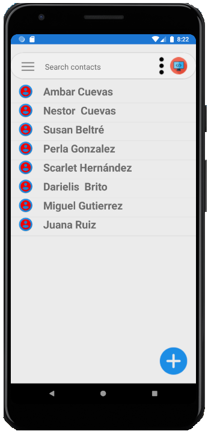
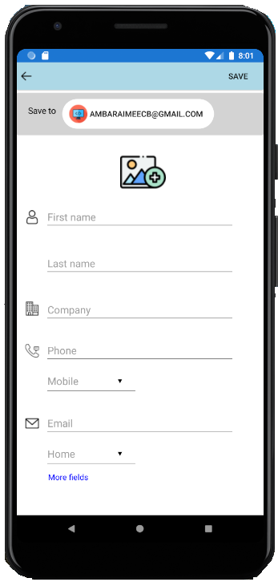
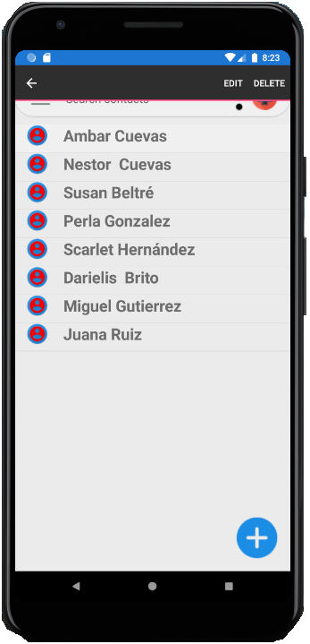
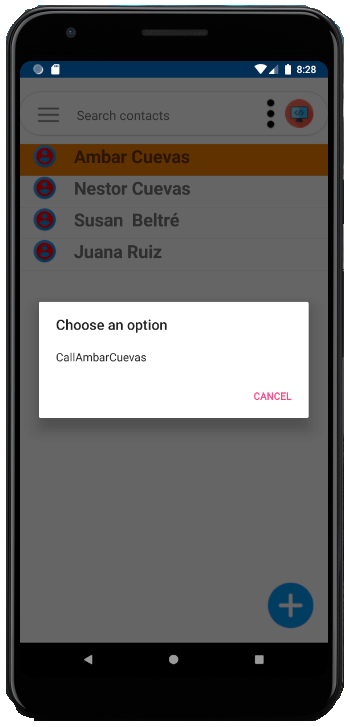

# ContactsApp
ContactsApp is a contact agenda application developed using the MVVM (Model-View-ViewModel) design pattern. Developed in Xamarin Forms for the Mobile app development with Xamarin Forms course at the Instituto Tecnológico de Santo Domingo.  The app has the following features: 
- Adding a contact 
- Deleting a contact 
- Modifying a contact 
- Calling a contact (using a method that redirects you to your local phone dialer with the selected phone number taken as a parameter)

<h2 style="text-align: center;"><strong>Contact agenda</strong></h2>

  

<h2 style="text-align: center;"><strong>Add new contact page</strong></h2>

 

  
<h2 style="text-align: center;"><strong>Context action menu</strong></h2>

<h2 style="text-align: center;"><strong>Phone call</strong></h2>

